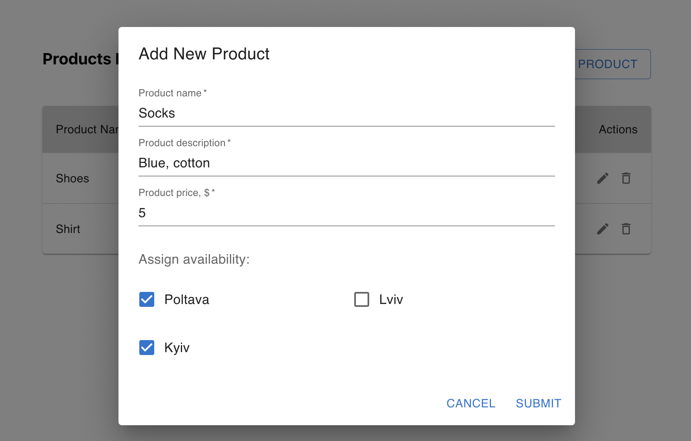
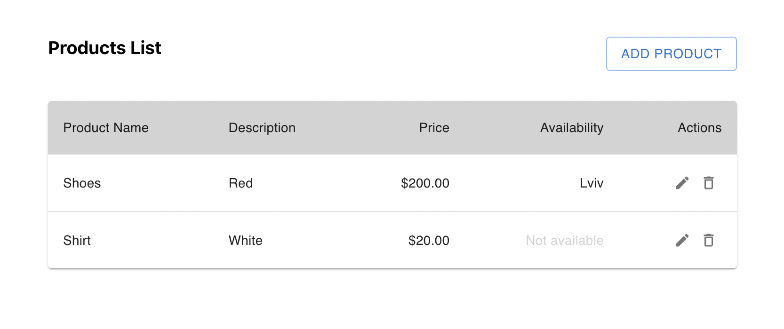

# Fullstack App Example

CRUD App with simple product items

## Stack

### Frontend
- ReactJS
- Zustand

### Backend
- NodeJS
- ExpressJS
- Prisma ORM
- SQLite DB

## You can run the app:

`cd backend`
`npm i`
`npm start`

`cd frontend`
`npm i`
`npm start`

